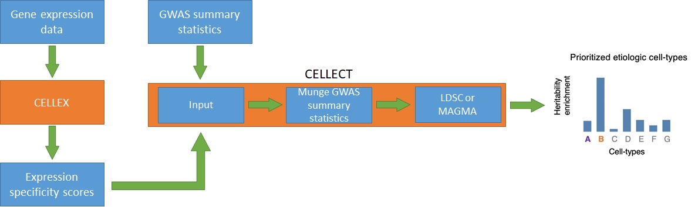

# Getting the required input

To use this web application, you first need to run the CELLEX (https://github.com/perslab/CELLEX) and CELLECT (https://github.com/perslab/CELLECT) tools on your data.

## Explanation of CELLEX and CELLECT workflow

Before showing how you can get the input files for the web application, I will give a brief description of the overall CELLEX and CELLECT workflow, as illustrated in the figure below:



First, gene expression data (upper left) is given as input to CELLEX (middle left). CELLEX then calculates Expression Specificity (ES) scores, which it denotes as *ESµ*. ESµ is calculated by combining four different measures of expression specificity (explained more in the detail in the following paper: https://doi.org/10.7554/eLife.55851):

- Expression Proportion (EP)
- Gene Enrichment Score (GES)
- Differential Expression T-statistic (DET)
- Normalized Specificity Index (NSI)

After having calculated ESµ for every gene across all cell types in the expression data, the ESµ values are provided as input to CELLECT together with GWAS summary statistics. As part of the CELLECT pipeline, the user has to first "munge" the summary statistics such that they are in a proper format as well as only encompass HapMap3 SNPs. Then, the munged summary statistics are provided as input to either (S-)LDSC or MAGMA, which use regression-based approaches to determine disease heritability for functional categories and genes, respectively. In the case of (S-)LDSC, the ESµ values for each cell type are used in a linear regression model _when_ estimating disease heritability, whereas for MAGMA the disease heritability is first estimated per gene and _then_ fitted together with the ESµ values in a linear regression model. The end result in both cases is a prioritized list of all the cell types in the expression data, ranked according to their significance value (P-value) signifying their (potential) involvement in disease etiology.

## Running CELLEX

_**NB:** The following section is a shortened example obtained from the CELLEX GitHub page (https://github.com/perslab/CELLEX). The different steps required to use the tool are explained more in detail on that same page._

To run CELLEX, you need the following input (the specific file names and file types are just examples - the important thing is being able to store the data a pandas dataframe objects in Python):

- **data.csv** - Gene expression dataset as a csv file, e.g. bulk RNA-seq or single-cell RNA-seq (cell IDs as columns, genes as rows). The file should contain the raw UMI counts (i.e. the data should not be batch corrected nor scaled/normalized).
- **metadata.csv** - Metadata as a csv file (one column with cell IDs, another column with the cell type for each cell).


You also need to install CELLEX from PyPI (Python 3.6+):

```python
pip install cellex
```


CELLEX can then be run on the data (the data doesn't need to be gzipped):

```python
import numpy as np
import pandas as pd
import cellex

data = pd.read_csv("./data.csv", index_col=0)
metadata = pd.read_csv("./metadata.csv", index_col=0)

eso = cellex.ESObject(data=data, annotation=metadata, verbose=True)
eso.compute(verbose=True)
eso.results["esmu"].to_csv("mydataset.esmu.csv.gz")
```

The result is a file `mydataset.esmu.csv.gz` (or `mydataset.esmu.csv`) containing an expression specificity (ES) score from 0 to 1 for each gene for each cell type, indicating how specifically expressed a gene is in a particular cell type (0 = not specifically expressed at all, 1 = very highly specifically expressed).


## Running CELLECT

_**NB:** The following section uses parts from and is heavily inspired by the examples and tutorial sections on the CELLECT GitHub page (https://github.com/perslab/CELLECT)._

CELLECT uses the following input (both of which you should already have at this point):

- **mydataset.esmu.csv** - The file containing ESµ values, generated previously via CELLEX (can be gzip compressed).
- **sumstats.txt** - GWAS summary statistics file (can be gzip compressed).


The first step is to clone the GitHub repository for CELLECT:

```bash
git clone https://github.com/perslab/CELLECT.git
```

The munging of sumstats and running CELLECT itself requires the use of different Anaconda environments. If Anaconda is not installed already, I recommend you download and install Miniconda (https://docs.conda.io/en/latest/miniconda.html).


Then, move into the cloned CELLECT repository, and create and activate the `munge_ldsc` conda environment which will be used for munging the GWAS summary statistics (the Python script used for munging was originally written in Python2, whereas CELLECT was written in Python3, hence the need for different environments):

```python
cd ./CELLECT
conda env create -f ldsc/environment_munge_ldsc.yml # can be skipped if the environment was created in a previous run
conda activate munge_ldsc
```


Then, munge summary statistics by running the `mtag_munge.py` scripts stored in the `ldsc` folder in the cloned repository - there are various parameters which can be used (type `python ldsc/mtag_munge.py --help` for more info), however the most important are shown in the example below:

```python
python ldsc/mtag_munge.py \
--sumstats sumstats.txt \ # path to sumstats file
--a1 major_allele \ # name of column with major allele in sumstats file
--a2 minor_allele \ # name of column with minor allele in sumstats file
--merge-alleles data/ldsc/w_hm3.snplist \ # path to file containing HapMap3 SNPs (included with CELLECT)
--p PVAL \ # name of column with P-values
--keep-pval \ # keep the column with P-values
--N N \ # name of column with sample sizes
--N-cas N_CAS \ # name of column with number of cases
--N-con N_CON \ # name of column with number of controls
--out munged_sumstats # name of output file
```


Then, if not already done from a previous run, create a new Python 3.7 conda environment called "cellect" and install `snakemake `:

```bash
conda create --name cellect python=3.7
conda activate cellect
conda install -c bioconda -c conda-forge snakemake">=5.27.4"
```


Afterwards, the last thing you need to do before running CELLECT is modify the `config.yml` file. You need to change the following:

- `BASE_OUTPUT_DIR:` The name of a folder where the output should be saved.
- `SPECIFICITY_INPUT:` Provide the "id" (the name CELLECT should use for the data) and "path" (the path to the `mydataset.esmu.csv.gz` file).
- `GWAS_SUMSTATS:` Provide the "id" (the name CELLECT should use for the data) and "path" (the path to the `munged_sumstats.gz` file).

There are several other settings which can be changed, however they should be left to their default values.


Now, CELLECT can be run. CELLECT supports two workflows - one utilizing (S-)LDSC, and one utilizing MAGMA. The web application I developed only works with MAGMA, however, so to run the CELLECT-MAGMA workflow type the following (the `-j` flag specifies the max number of cores to use):

```bash
snakemake --use-conda -j 20 -s cellect-magma.snakefile --configfile config.yml
```


You can find all the files generated by CELLECT in the folder `output_folder/CELLECT-MAGMA`. For the cell type prioritization results, you can take a look at the file `output_folder/CELLECT-MAGMA/results/prioritization.csv`.

